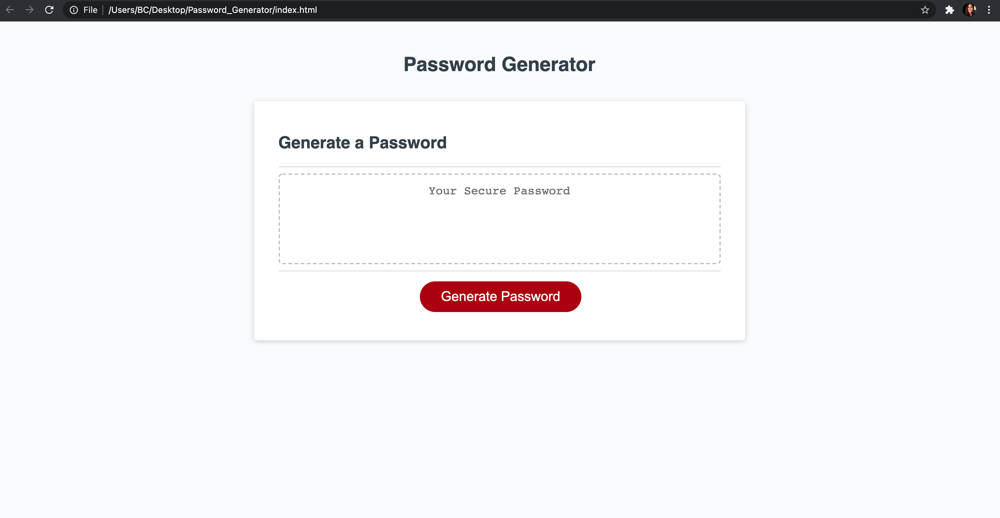
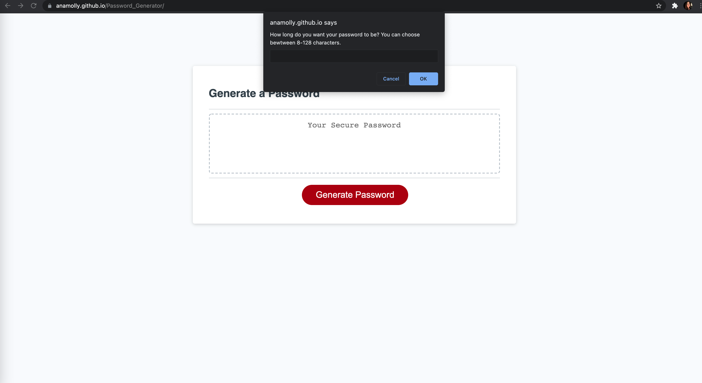
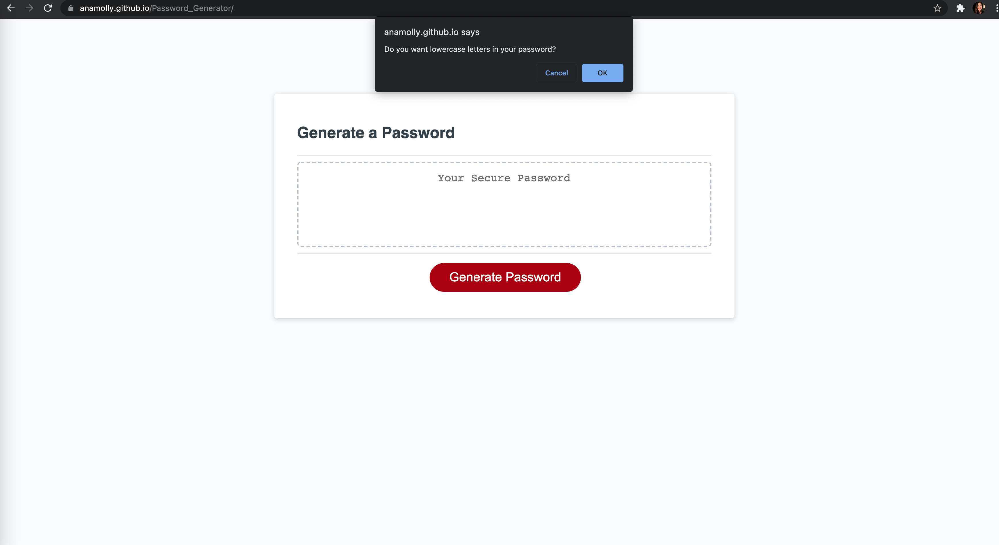
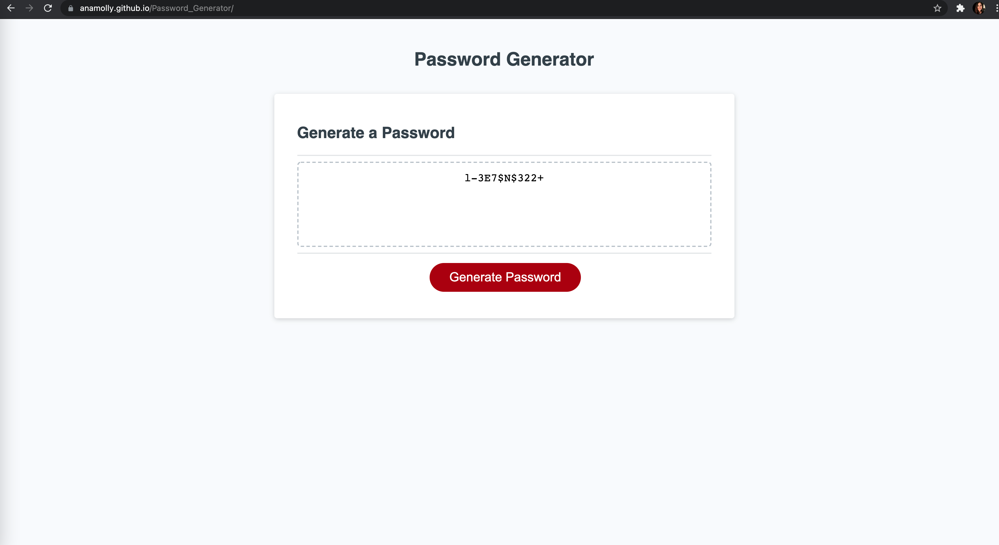

# 03 JavaScript: Password Generator

This password generator was created using:
- HTML 
- CSS 
- Javascript 

This particular password generator is capable of creating passwords between 8 and 128 characters. It also allows you to choose the criteria of the password by presenting you with character options (i.e. uppercase, lowercase, numbers and special characters). All options can be included, but at least one option must be selected in order for the password generator to work. 

# Screenshot:

The prompt to include password character length:

One of the character options:

Example of a generated password with all character options included:

# Deployed URL:

https://anamolly.github.io/Password_Generator/
