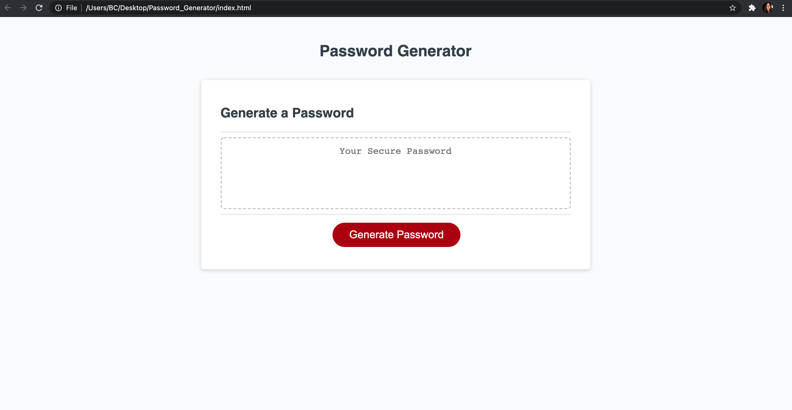

# 03 JavaScript: Password Generator

This password generator was created using HTML, CSS and Javascript. It is capable of generating passwords between 8 and 128 characters. It also presents you with character options (i.e. uppercase, lowercase, numbers and special characters) for your password. All options can be included, but at least one option must be selected in order for the password generator to work. 

# Javascript File:
- Arrays for uppercase and lowercase letters, numbers and special characters were created. Two empty arrays were also created.
- Within the function, there are empty arrauys for the final password
- Within the writePassword function, a variable for the initial alert was created
- Another variable was created to prompt the user for their desired password length
- The password length was then converted to a number using parseInt
- An if statement was included that checks to see if the password length meets the criteria. If the password length doesn't meet the criteria, it will alert the user that their input was invalid and prompt them to input a correct value. If they input an ivalid response, they will be alerted that they need to press the Generate Password button again.
- A second if statement was included that checks to see if the password length input meets the criteria, and if it does, it will present the user with the criteria questions, which are held in variables.
- A third if statment was included to check if at least one password criteria was chosen. If one was not chosen, it alerts the user that they must select one character type.
- Four other if statements were included to check if the use agreed or disagreed to certain password criteria. If the user agreed, random characters will be pushed into a new array. After all the criteria is chosen and pushed to the new array, random characters are chosen that match the length of the password and are pushed to a new array.
- Then, the password id is selected through the use of a variable. The value of that variable is then equalled to the final array (which is being joined into one string). The password is then displayed in the password field.

# Screenshot:

# Deployed URL:

https://anamolly.github.io/Password_Generator/
